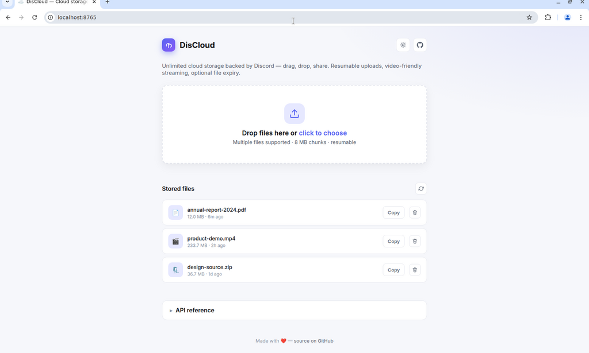
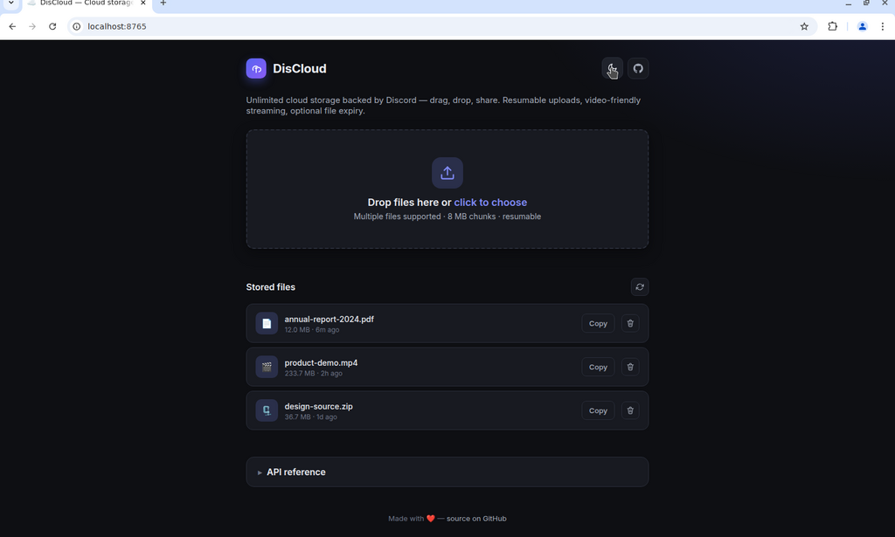

# DisCloud

> Cloud storage backed by Discord. Upload files of any size; the server splits
> them into 8 MB chunks, stores each chunk as a Discord channel attachment,
> and serves them back as one stream — with HTTP range support for video.

[](https://github.com/tranhoangmanh/discloud/actions/workflows/ci.yml)
[](https://github.com/tranhoangmanh/discloud/actions/workflows/docker-image.yml)
[](.nvmrc)
[](LICENSE)

🇻🇳 **Tiếng Việt:** [README.vi.md](./README.vi.md)

<p align="center">
  
  
</p>

## Table of Contents

- [Features](#features)
- [Architecture](#architecture)
- [Quick start](#quick-start)
- [Setup guide (Discord bot)](#setup-guide-discord-bot)
- [Configuration](#configuration)
- [API](#api)
- [Examples](#examples)
- [Scripts](#scripts)
- [Project layout](#project-layout)
- [Development](#development)
- [Troubleshooting](#troubleshooting)
- [Limitations](#limitations)
- [Acknowledgements](#acknowledgements)
- [License](#license)

## Features

- ☁️ **Unlimited storage** — split files into 8 MB chunks, store as Discord
  channel attachments, serve them back as one stream.
- 🎬 **Video-friendly streaming** with full HTTP `Range:` support.
- 🔁 **Resumable uploads** via session API + Server-Sent Events progress stream.
- 🔐 **SHA-256 integrity** + ETag-based conditional requests.
- ♻️ **Auto URL refresh** — Discord CDN URLs expire after ~24 h; DisCloud
  stores `messageId`s and re-fetches signed URLs on demand.
- 🎨 **Modern UI** — drag & drop, multi-file uploads, light/dark theme.
- 📦 **Docker-first** — multi-stage image, non-root, healthcheck, multi-arch.

## Architecture

```
                                 ┌────────────────┐
       upload (chunked,          │   Discord API  │
       backpressure)             │ (channel msgs) │
client ──────────►  Express  ───►│   attachments  │
                       │         └────────────────┘
                       ▼
                ┌──────────┐
                │  Redis   │  ← metadata: fileId → { fileName, size,
                └──────────┘                          chunkSize, parts: [{ messageId, … }] }
```

Each part stores the Discord `messageId` (not just the URL), so when a client
downloads, the server can **refresh expired CDN URLs** (Discord attachment
URLs are signed and expire after ~24 hours).

## Quick start

```bash
git clone https://github.com/tranhoangmanh/discloud.git
cd discloud
cp .env.example .env
# Fill in REDIS_URL, DISCORD_BOT_TOKEN, DISCORD_CHANNEL_ID

npm install
npm run dev          # tsx watcher
# or
npm run build && npm start
```

Open <http://localhost:5000>.

### Docker

```bash
docker run -p 5000:5000 \
  -e REDIS_URL=redis://host.docker.internal:6379 \
  -e DISCORD_BOT_TOKEN=... \
  -e DISCORD_CHANNEL_ID=... \
  ghcr.io/tranhoangmanh/discloud:latest
```

### Docker Compose

```yaml
# docker-compose.yml
services:
  redis:
    image: redis:7-alpine
    restart: unless-stopped
    volumes:
      - redis-data:/data

  discloud:
    image: ghcr.io/tranhoangmanh/discloud:latest
    restart: unless-stopped
    ports:
      - "5000:5000"
    environment:
      REDIS_URL: redis://redis:6379
      DISCORD_BOT_TOKEN: ${DISCORD_BOT_TOKEN}
      DISCORD_CHANNEL_ID: ${DISCORD_CHANNEL_ID}
    depends_on:
      - redis

volumes:
  redis-data:
```

```bash
docker compose up -d
```

## Setup guide (Discord bot)

1. Create a [Redis](https://redis.com/) instance and copy the connection URL → `REDIS_URL`.
2. Create a Discord server you control.
3. Go to the [Discord Developer Portal](https://discord.com/developers/applications),
   create a new application, then add a Bot.
   - Reset the token, copy it → `DISCORD_BOT_TOKEN`.
   - Copy the **APPLICATION ID**.
4. Invite the bot:
   `https://discord.com/oauth2/authorize?client_id={CLIENT_ID}&scope=bot&permissions=2048`
   (replace `{CLIENT_ID}` with the application ID).
5. Pick a channel; right-click → "Copy Channel ID" → `DISCORD_CHANNEL_ID`.

> ⚠️ **About Discord ToS:** Using a bot to store arbitrary files for end users
> can violate Discord's Terms of Service. Use this only for personal projects
> and at your own risk.

## Configuration

| Variable                     | Default          | Description                                     |
| ---------------------------- | ---------------- | ----------------------------------------------- |
| `REDIS_URL`                  | _required_       | Redis connection URL                            |
| `DISCORD_BOT_TOKEN`          | _required_       | Bot token used to upload                        |
| `DISCORD_CHANNEL_ID`         | _required_       | Channel where chunks are posted                 |
| `PORT`                       | `5000`           | HTTP port                                       |
| `LOG_LEVEL`                  | `info`           | Pino log level                                  |
| `NODE_ENV`                   | `development`    | `development` / `production` / `test`           |
| `CORS_ORIGINS`               | `*`              | Comma-separated allowed origins                 |
| `DISCORD_UPLOAD_CONCURRENCY` | `2`              | Parallel uploads to Discord                     |
| `FILE_TTL_SECONDS`           | `0`              | TTL for stored file metadata (0 = no expiry)    |
| `DEFAULT_RANGE_SIZE`         | `5242880` (5 MB) | Default size for an open-ended `Range:` request |

## API

### Direct upload

```
POST /upload?fileName=<name>
Content-Type: <mime>

<bytes>
```

Returns:

```json
{
  "fileId": "…",
  "fileSize": 12345,
  "sha256": "…",
  "url": "/file/<fileId>",
  "longURL": "/file/<fileId>/<fileName>",
  "downloadURL": "/file/<fileId>?download=1",
  "longDownloadURL": "/file/<fileId>/<fileName>?download=1",
  "parts": ["https://cdn.discordapp.com/…", …]
}
```

### Resumable upload

```
POST /upload/init                  → { uploadId, progressUrl }
POST /upload/:uploadId             → append more bytes (any size)
POST /upload/:uploadId/complete    → { fileId, … }
GET  /upload/:uploadId             → status
GET  /upload/:uploadId/events      → SSE stream of progress events
DELETE /upload/:uploadId           → cancel
```

### Files

```
GET    /files                  → paginated list
GET    /files/:id              → metadata
DELETE /files/:id              → remove (also deletes Discord messages)
GET    /file/:id               → download (supports Range)
GET    /file/:id/:fileName     → download with original name
```

### Health

```
GET /health   → { status, redis, uptime }
```

## Examples

### Upload a file

```bash
curl -X POST \
  --data-binary @video.mp4 \
  -H "Content-Type: video/mp4" \
  "http://localhost:5000/upload?fileName=video.mp4"
```

### Resumable upload

```bash
# 1. init session
UPLOAD_ID=$(curl -s -X POST -H "Content-Type: application/json" \
  -d '{"fileName":"big.iso","fileSize":4500000000}' \
  http://localhost:5000/upload/init | jq -r .uploadId)

# 2. upload bytes (can repeat after a network failure)
curl -X POST --data-binary @big.iso "http://localhost:5000/upload/$UPLOAD_ID"

# 3. follow progress in another terminal
curl -N "http://localhost:5000/upload/$UPLOAD_ID/events"

# 4. finalize
curl -X POST "http://localhost:5000/upload/$UPLOAD_ID/complete"
```

### List files

```bash
curl "http://localhost:5000/files?limit=20&offset=0" | jq
```

### Download a range (video seek)

```bash
curl -H "Range: bytes=1048576-2097151" \
  -o chunk.bin \
  "http://localhost:5000/file/<fileId>"
```

### Delete a file

```bash
curl -X DELETE "http://localhost:5000/files/<fileId>"
```

## Scripts

| Command             | Description                      |
| ------------------- | -------------------------------- |
| `npm run dev`       | Start the dev server (tsx watch) |
| `npm run build`     | Compile TypeScript to `dist/`    |
| `npm start`         | Start the compiled server        |
| `npm run lint`      | ESLint                           |
| `npm run format`    | Prettier (write)                 |
| `npm run typecheck` | `tsc --noEmit`                   |
| `npm test`          | Run the unit test suite (vitest) |

## Project layout

```
src/
  index.ts            # bootstrap, graceful shutdown
  app.ts              # express setup
  config.ts           # env validation (zod)
  logger.ts           # pino
  routes/             # http handlers (upload, download, files, health)
  services/           # discord, redis, sse broker
  middleware/         # cors, error handler
  utils/              # range parser, filename helpers, …
test/                 # vitest unit tests
static/               # frontend (drag-drop UI, light/dark)
docs/images/          # README screenshots
.github/workflows/    # CI + Docker image
```

## Development

```bash
git clone https://github.com/tranhoangmanh/discloud.git
cd discloud
npm install
cp .env.example .env

npm run dev        # tsx watch (auto-restart on changes)
npm test           # vitest unit tests
npm run lint       # ESLint
npm run typecheck  # tsc --noEmit
```

Husky + lint-staged run ESLint and Prettier on every commit.

PRs are welcome. Please make sure `npm run lint`, `npm run typecheck` and
`npm test` all pass before submitting.

## Troubleshooting

<details>
<summary><b>Files become unavailable after ~24 hours</b></summary>

Older versions of this project stored Discord CDN URLs directly. Those URLs
are signed and expire after ~24 hours. The current version stores Discord
`messageId`s and re-fetches the signed URL on demand, so this should no
longer happen. If you upgraded from an older version, files uploaded
**before** the upgrade will not have stored `messageId`s and will need to be
re-uploaded.

</details>

<details>
<summary><b>Uploads are very slow</b></summary>

Discord rate-limits bot requests (5 file attachments / 5 s on free
applications). Increase `DISCORD_UPLOAD_CONCURRENCY` cautiously — going
above ~3 reliably triggers 429 responses. The internal `p-queue` already
applies exponential backoff on 429.

</details>

<details>
<summary><b><code>Error: invalid Discord token</code> on startup</b></summary>

Make sure `DISCORD_BOT_TOKEN` is the **bot** token (Developer Portal → Bot →
Reset Token), not the application's client secret. Bot tokens start with
characters like `MT...` or `OD...`.

</details>

<details>
<summary><b>I get <code>416 Range Not Satisfiable</code></b></summary>

This is correct behaviour for malformed `Range:` headers (e.g.
`bytes=abc-`) or ranges past the file size. Most browsers/players never
issue invalid ranges; this typically only shows up in custom clients.

</details>

<details>
<summary><b>The progress bar stays at 0% but the upload finishes</b></summary>

`xhr.upload.onprogress` only fires while the request body is being sent.
Discord forwards the request body to the channel _after_ that, which can
take a few seconds for large files. Use the SSE `/upload/:id/events` stream
for chunk-level progress instead.

</details>

## Limitations

- Anyone with a `fileId` can download the file (no authentication built in).
  Adding an auth middleware is straightforward — see `src/middleware/`.
- File chunks are stored in your Discord channel as bot messages; deletion
  goes through the Discord API and is best-effort.
- `chunkSize` is fixed at 8 MB (Discord's free attachment cap).
- Discord may, at any time, change ToS in a way that affects this project.

## Acknowledgements

- Original idea/code: [napthedev/discloud](https://github.com/napthedev/discloud).
- Stream backpressure helper: [forscht/ddrive](https://github.com/forscht/ddrive).

## License

[MIT](LICENSE)
